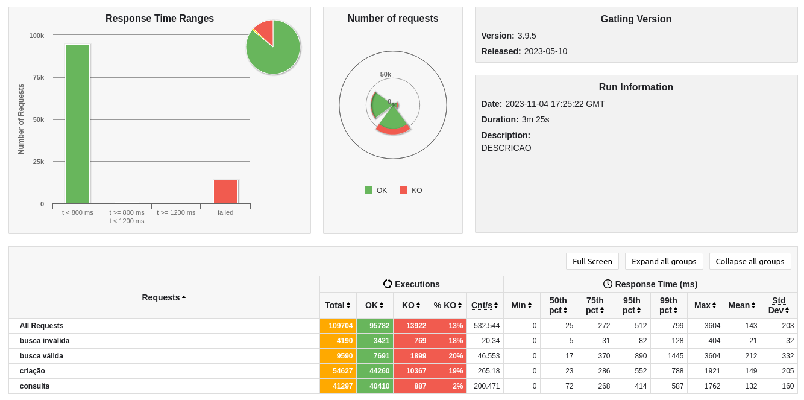

# Rinha de Backend Rust - 2023 Q3

Minha versão em Rust com o framework Actix para a rinha de backend - 2023 Q3 (Feita semanas depois da competição ter acabado, apenas uma desculpa para experimentar Rust).

Ferramentas usadas:

- Rust v1.72.1;
- Actix v4.4.0;
- Postgres v15.

## Resultados (testado por último em 04/11/2023)



## Como iniciar (development build) 🛠

```bash
cp .env.example .env # cria o arquivo de variáveis de ambiente (nesse projeto utilizado apenas em desenvolvimento)
docker-compose -f docker-compose-dev.yml up --build # inicia o container Postgres para desenvolvimento
cargo build # instala as dependências declaradas em Cargo.toml
cargo watch -x run # inicia a API em modo watch
```

## Como iniciar (prod build) 🛠

```bash
docker-compose up --build # inicia os containers Postgres, Nginx e das duas instâncias da API
```

----------
Released in 2023

By [Victor B. Fiamoncini](https://github.com/Victor-Fiamoncini) ☕️
